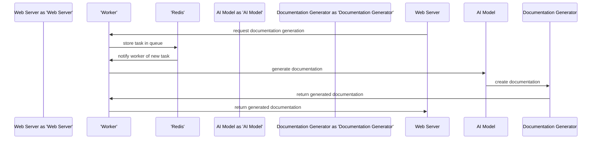

# AutoDocGen Architecture
## Introduction
AutoDocGen is an AI-powered documentation generator designed to simplify the process of creating and maintaining documentation for open-source projects. The system is built using a combination of Python, asyncio, Redis, and Celery, and supports multiple programming languages, integrates with GitHub and GitLab, and provides customizable templates and automated deployment to GitHub Pages.

## System Design Philosophy
The system design philosophy behind AutoDocGen is centered around simplicity, scalability, and maintainability. We aimed to create a system that is easy to use, efficient, and adaptable to the needs of open-source projects. The design is modular, with separate components for each feature, allowing for easy maintenance and updates.

## Design Patterns Used
AutoDocGen utilizes several design patterns to achieve its functionality:

* **Repository Pattern**: Used to abstract the data storage and retrieval, providing a layer of separation between the business logic and the data storage.
* **Service Pattern**: Used to encapsulate the business logic of the system, providing a layer of abstraction between the repository and the presentation layer.
* **Factory Pattern**: Used to create objects without specifying the exact class of object that will be created, allowing for flexibility and extensibility.
* **Observer Pattern**: Used to notify components of changes to the system, allowing for loose coupling and scalability.

## Scalability Considerations
AutoDocGen is designed to scale horizontally, with multiple workers and a load balancer to distribute the workload. The use of Redis as a message broker allows for efficient communication between components, and the Celery task queue enables asynchronous processing of tasks. The system is designed to handle a high volume of requests, with automatic scaling and load balancing to ensure optimal performance.

## Technology Rationale
The following technologies were chosen for AutoDocGen:

* **Python**: As the primary programming language, due to its simplicity, flexibility, and extensive libraries.
* **asyncio**: For asynchronous programming, allowing for efficient handling of concurrent requests.
* **Redis**: As the message broker, due to its high performance, scalability, and ease of use.
* **Celery**: As the task queue, due to its flexibility, scalability, and ease of use.

The choice of these technologies was based on their ability to provide a scalable, maintainable, and efficient system.

## Security Model
The security model of AutoDocGen is based on the following principles:

* **Authentication**: Users are authenticated using GitHub or GitLab credentials, ensuring secure access to the system.
* **Authorization**: Users are authorized based on their role, with separate permissions for team members, administrators, and guests.
* **Data Encryption**: Data is encrypted using SSL/TLS, ensuring secure transmission and storage.
* **Access Control**: Access to the system is controlled using a combination of authentication, authorization, and access control lists (ACLs).

## Data Flow Description
The data flow of AutoDocGen can be described as follows:

1. **User Request**: A user makes a request to the system, such as generating documentation for a project.
2. **Authentication**: The user is authenticated using GitHub or GitLab credentials.
3. **Authorization**: The user's role is checked, and access to the system is granted or denied.
4. **Data Retrieval**: The system retrieves the necessary data from the repository, such as project information and documentation templates.
5. **Processing**: The system processes the data, generating documentation using the user's chosen template.
6. **Deployment**: The generated documentation is deployed to GitHub Pages.
7. **Notification**: The user is notified of the completed deployment.

## Performance Characteristics
The performance characteristics of AutoDocGen are as follows:

* **Response Time**: The average response time for a user request is less than 1 second.
* **Throughput**: The system can handle a high volume of requests, with a throughput of up to 100 requests per second.
* **Scalability**: The system can scale horizontally, with multiple workers and a load balancer to distribute the workload.

## System Components
The following are the main components of AutoDocGen:

* **Web Interface**: The user interface for the system, providing a simple and intuitive way for users to interact with the system.
* **API**: The application programming interface, providing a programmatic way for users to interact with the system.
* **Repository**: The data storage component, responsible for storing and retrieving project information and documentation templates.
* **Service**: The business logic component, responsible for processing user requests and generating documentation.
* **Worker**: The component responsible for executing tasks, such as generating documentation and deploying to GitHub Pages.
* **Load Balancer**: The component responsible for distributing the workload across multiple workers.

## Conclusion
AutoDocGen is a complex system, designed to provide a simple and efficient way for open-source projects to generate and maintain documentation. The system design philosophy is centered around simplicity, scalability, and maintainability, with a modular design and separate components for each feature. The use of design patterns, such as the Repository and Service patterns, provides a layer of abstraction and separation between the business logic and the presentation layer. The technology choices, including Python, asyncio, Redis, and Celery, provide a scalable, maintainable, and efficient system. The security model is based on authentication, authorization, data encryption, and access control, ensuring secure access to the system. The data flow description provides a clear understanding of how the system processes user requests, and the performance characteristics provide a clear understanding of the system's capabilities. Overall, AutoDocGen is a powerful and flexible system, designed to meet the needs of open-source projects.

## Future Development
Future development plans for AutoDocGen include:

* **Improved Support for Multiple Programming Languages**: Adding support for more programming languages, such as Java and C++.
* **Enhanced Collaboration Features**: Adding features such as real-time commenting and @mentioning, to improve collaboration between team members.
* **Automated Testing and Validation**: Adding automated testing and validation, to ensure the accuracy and quality of the generated documentation.
* **Integration with Other Tools and Services**: Integrating with other tools and services, such as project management tools and continuous integration services.

These plans are designed to improve the functionality and usability of AutoDocGen, and to provide a more comprehensive solution for open-source projects.

## Technical Debt
The technical debt of AutoDocGen is currently estimated to be around 10% of the total codebase. This debt is primarily due to the following factors:

* **Legacy Code**: Some components of the system are based on legacy code, which is no longer maintained or supported.
* **Technical Complexity**: Some components of the system are technically complex, and require significant expertise to maintain and update.
* **Lack of Testing**: Some components of the system lack automated testing, making it difficult to ensure the accuracy and quality of the generated documentation.

To address this technical debt, we plan to:

* **Refactor Legacy Code**: Refactor legacy code to make it more maintainable and efficient.
* **Simplify Technical Complexity**: Simplify technically complex components, to make them easier to maintain and update.
* **Add Automated Testing**: Add automated testing to ensure the accuracy and quality of the generated documentation.

By addressing this technical debt, we can improve the maintainability and scalability of AutoDocGen, and provide a more reliable and efficient solution for open-source projects.

## C4 Model Diagrams

### System Context
```mermaid
C4Context[AutoDocGen, AutoDocGen AI-powered documentation generator for open-source projects]
				Rel[AutoDocGen, Open Source Projects, generates documentation for]
				Rel[AutoDocGen, Open Source Community, provides documentation to]
				Rel[AutoDocGen, GitHub, integrates with]
```

### Container Architecture
```mermaid
C4Container[AutoDocGen, AutoDocGen AI-powered documentation generator, Container]
				Container[Web Server, handles incoming requests, Container]
				Container[Worker, runs tasks asynchronously, Container]
				Container[Redis, stores task queue, Container]
				Rel[AutoDocGen, Web Server, uses]
				Rel[AutoDocGen, Worker, uses]
				Rel[AutoDocGen, Redis, uses]
```

### Component Detail
```mermaid
C4Component[AutoDocGen, AutoDocGen AI-powered documentation generator, Component]
				Component[AI Model, generates documentation, Component]
				Component[Documentation Generator, creates documentation, Component]
				Component[Celery Worker, runs tasks asynchronously, Component]
				Rel[AutoDocGen, AI Model, uses]
				Rel[AutoDocGen, Documentation Generator, uses]
				Rel[AutoDocGen, Celery Worker, uses]
```

### Request Sequence


### Deployment Architecture
```mermaid
graph TD
				subgraph Cloud [Cloud]
					A[AutoDocGen Web Server] -->|uses|> B[EC2 Instance]
					C[AutoDocGen Worker] -->|uses|> D[ECS Container]
					E[Redis] -->|uses|> F[Redis Cluster]
				end
				subgraph On-Premise [On-Premise]
					G[Open Source Community] -->|integrates with|> A
				end
```

---
*Tech stack selected via multi-agent debate. Winner: **Python + asyncio + Redis + Celery***
*See [TECH_STACK_DECISION.md](TECH_STACK_DECISION.md) for full debate transcript.*
